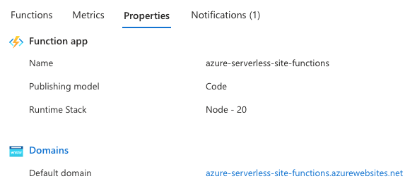

# Azure Serverless Web App with Static and Dynamic Parts

This project demonstrates a simple serverless web application using Azure services. It consists of a static frontend served via Azure CDN, while the dynamic backend is powered by an Azure Function App. Both parts are configured using Terraform, ensuring a fully automated, scalable, and maintainable setup.

## Table of Contents

1. [Azure Serverless Web App with Static and Dynamic Parts](#azure-serverless-web-app-with-static-and-dynamic-parts)
2. [Prerequisites](#prerequisites)
3. [Architecture Overview](#architecture-overview)
   - [Static Files](#static-files)
   - [Function App](#function-app)
   - [CDN](#cdn)
   - [Custom Domain](#custom-domain)
4. [Deployment Steps](#deployment-steps)
   1. [Clone the Repository](#clone-the-repository)
   2. [Set Up Your Variables](#set-up-your-variables)
   3. [Initialize Terraform](#initialize-terraform)
   4. [Plan Your Changes](#plan-your-changes)
   5. [Apply the Configuration](#apply-the-configuration)
   6. [Access Your CDN Endpoint](#access-your-cdn-endpoint)
5. [Structure](#structure)
6. [Clean Up](#clean-up)
7. [Notes](#notes)
8. [Elements](#elements)
   1. [Azure CDN and Storage Account Interaction](#azure-cdn-and-storage-account-interaction)
   2. [Azure Function App](#azure-function-app)
   3. [CORS (Cross-Origin Resource Sharing)](#cors-cross-origin-resource-sharing)
   4. [Route 53 and Custom Domain](#route-53-and-custom-domain)

## Azure Serverless Web App with Static and Dynamic Parts

This project demonstrates a simple serverless web application using Azure services. It consists of a static frontend served via Azure CDN, while the dynamic backend is powered by an Azure Function App. Both parts are configured using Terraform, ensuring a fully automated, scalable, and maintainable setup.

## Prerequisites

To get started, ensure you have the following prerequisites installed:

- **Terraform** (v1.9.7+)
- **Azure CLI** for managing resources in Azure
- **AWS CLI** (if you plan to integrate Route 53)
- **Azure subscription** to deploy the resources
- **A domain registered in Route 53** for custom domain setup

## Architecture Overview

1. **Static Files**: Hosted in an Azure Storage Account, delivered via Azure CDN.
2. **Function App**: Handles dynamic requests, using a Node.js runtime.
3. **CDN**: Speeds up the delivery of static content and leverages HTTPS for secure access.
4. **Custom Domain**: Configured with AWS Route 53 and Azure CDN.

## Deployment Steps

### 1. Clone the Repository

Clone this repository to your local machine.

```
git clone <repository-url>
cd azure_serverless_site
```

### 2. Set Up Your Variables

Update the `terraform.tfvars` file with the required variables such as `project`, `cdn_profile_sku`, and `public_domain`.

### 3. Initialize Terraform

Before applying any changes, initialize the Terraform project.

```
terraform init
```

### 4. Plan Your Changes

To see what Terraform will deploy, use the `plan` command.

```
terraform plan -out=plan.out
```

### 5. Apply the Configuration

After reviewing the plan, apply the configuration to deploy the resources.

```
terraform apply plan.out
```

### 6. Access Your CDN Endpoint

After the deployment, the CDN endpoint will be available. The URL can be found as the output of the Terraform process.

```
terraform output cdn_endpoint_url
```

## Structure

The project structure is organized as follows:

```
azure_serverless_site
├── README.md
├── terraform
│   ├── cdn.tf
│   ├── function-code
│   │   ├── azure-serverless-site-functions
│   │   │   ├── App.js
│   │   │   └── function.json
│   │   ├── function_code.zip
│   │   └── host.json
│   ├── functionapp.tf
│   ├── main.tf
│   ├── outputs.tf
│   ├── plan.out
│   ├── providers.tf
│   ├── route53.tf
│   ├── site_files
│   ├── site_files_index_template
│   │   └── index.html.tmpl
│   ├── storage_account.tf
│   ├── terraform.tfstate
│   ├── terraform.tfstate.backup
│   ├── terraform.tfvars
│   └── variables.tf
```

## Clean Up

To destroy the resources and clean up your Azure environment:

```
terraform destroy
```

This will remove all the deployed resources.

## Notes

- The CDN and Function App are set to use TLS for secure access.
- The static content is served from Azure Storage and compressed for optimization.
- The dynamic backend is handled via an Azure Function App, which is deployed as part of this project.

## Elements

### 1. Azure CDN and Storage Account Interaction

**Components:**
- **Azure CDN**: Responsible for delivering static content like HTML, CSS, and JavaScript to users, ensuring faster load times via caching and geographic distribution.
- **Azure Storage Account**: Hosts the static files (like the website's HTML and assets) in a blob container.

**Interaction:**
The CDN fetches content from the Storage Account. When a user accesses your website, the CDN will serve files directly from cache or from the storage account’s blob container if they're not cached yet.


### 2. Azure Function App

**Component:**
- **Azure Function App**: Handles the dynamic part of your web app. When the user interacts with forms or needs dynamic content, the function app processes the requests.

**Interaction:**
The **Azure Function App** receives HTTP requests from the website (via the Azure CDN) and returns dynamic responses. The Function App is linked with a **Linux service plan** and is triggered by events or HTTP calls.



### 3. CORS (Cross-Origin Resource Sharing)

**Component:**
- **CORS Configuration**: Ensures that only the specified origins (in this case, your site hosted on the CDN) can make requests to the Azure Function App.

**Interaction:**
The CORS policy prevents unauthorized websites from calling your Function App's endpoints. This ensures that only requests originating from your CDN domain are allowed to interact with the Function App.


### 4. Route 53 and Custom Domain

**Components:**
- **AWS Route 53**: Used to manage your DNS records, mapping your custom domain to the CDN endpoint.
- **Custom Domain**: Set up with Route 53 to route traffic to your Azure CDN.

**Interaction:**
Route 53 manages DNS traffic, routing requests to the Azure CDN endpoint using a custom domain (e.g., `https://azure-serverless-site.brewsentry.com/`). The custom domain is mapped via a **CNAME record**.

```bash
; <<>> DiG 9.10.6 <<>> azure-serverless-site.brewsentry.com CNAME
;; global options: +cmd
;; Got answer:
;; ->>HEADER<<- opcode: QUERY, status: NOERROR, id: 60874
;; flags: qr aa rd ra; QUERY: 1, ANSWER: 3, AUTHORITY: 0, ADDITIONAL: 1

;; OPT PSEUDOSECTION:
; EDNS: version: 0, flags:; udp: 4096
;; QUESTION SECTION:
;azure-serverless-site.brewsentry.com. IN CNAME

;; ANSWER SECTION:
azure-serverless-site.brewsentry.com. 31 IN CNAME azure-serverless-site.azureedge.net.
azure-serverless-site.azureedge.net. 60	IN CNAME azure-serverless-site.afd.azureedge.net.
azure-serverless-site.afd.azureedge.net. 60 IN CNAME azureedge-t-prod.trafficmanager.net.

;; Query time: 3 msec
;; SERVER: 192.168.179.1#53(192.168.179.1)
;; WHEN: Thu Oct 24 12:16:00 EDT 2024
;; MSG SIZE  rcvd: 216
```